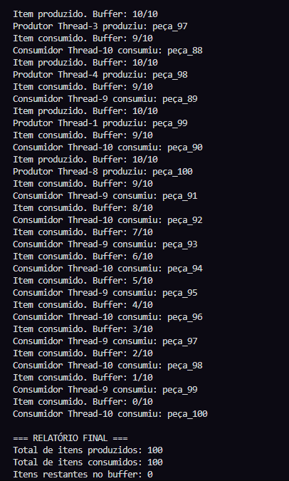

# Sistema Distribuído de Produção e Consumo de Peças

Este projeto demonstra um sistema distribuído de produção e consumo de peças usando Python. O sistema utiliza múltiplos produtores e consumidores que interagem com um buffer compartilhado, controlando o acesso e sincronização através de threads e travas. O objetivo é simular a dinâmica de um sistema de produção/consumo com capacidade limitada de armazenamento.

## Estrutura do Projeto

O projeto é dividido em três partes principais:

### 1. **Buffer Compartilhado**
   - Um buffer de capacidade limitada é utilizado para armazenar as peças produzidas.
   - O buffer controla a adição e remoção de peças pelos produtores e consumidores, respeitando o limite de capacidade.

### 2. **Threads de Produtores e Consumidores**
   - **Produtores:** Geram peças e tentam adicioná-las ao buffer. Caso o buffer esteja cheio, eles esperam até que haja espaço disponível.
   - **Consumidores:** Retiram peças do buffer para consumi-las. Caso o buffer esteja vazio, eles esperam até que haja peças disponíveis.
   - Cada thread é controlada para garantir que o número total de operações de produção e consumo seja mantido conforme o limite estabelecido.

### 3. **Relatório Final**
   - Ao final da execução, um relatório é exibido com o total de peças produzidas e consumidas, além da quantidade de peças restantes no buffer.

   **Exemplo de Execução:**
   

## Executando o Projeto

1. **Instalações Necessárias:**
   - Certifique-se de ter o Python 3.x instalado.

2. **Arquivos do Projeto:**
   - `main.py`: Arquivo principal que inicia e gerencia as threads de produtores e consumidores.
   - `buffer.py`: Implementação do buffer com controle de capacidade.
   - `producer_consumer.py`: Definição das classes `Producer` e `Consumer` que manipulam o buffer.

3. **Executando o Projeto:**
   - Abra um terminal na pasta do projeto e execute o comando:
     ``` 
     python main.py
     ```

4. **Exibição de Resultados:**
   - Durante a execução, o terminal exibirá as operações realizadas pelos produtores e consumidores. Ao final, um relatório será gerado indicando o total de peças produzidas e consumidas, e as peças restantes no buffer.

## Contribuições
Contribuições são bem-vindas! Sinta-se à vontade para sugerir melhorias, abrir issues ou enviar pull requests.

## Licença
Este projeto está licenciado sob a MIT License.

## Time do Projeto
   - Dilermando Afonso
   - Labelle Cândido
   - Michael Azevedo
   - Rafael "A lenda" Diniz
